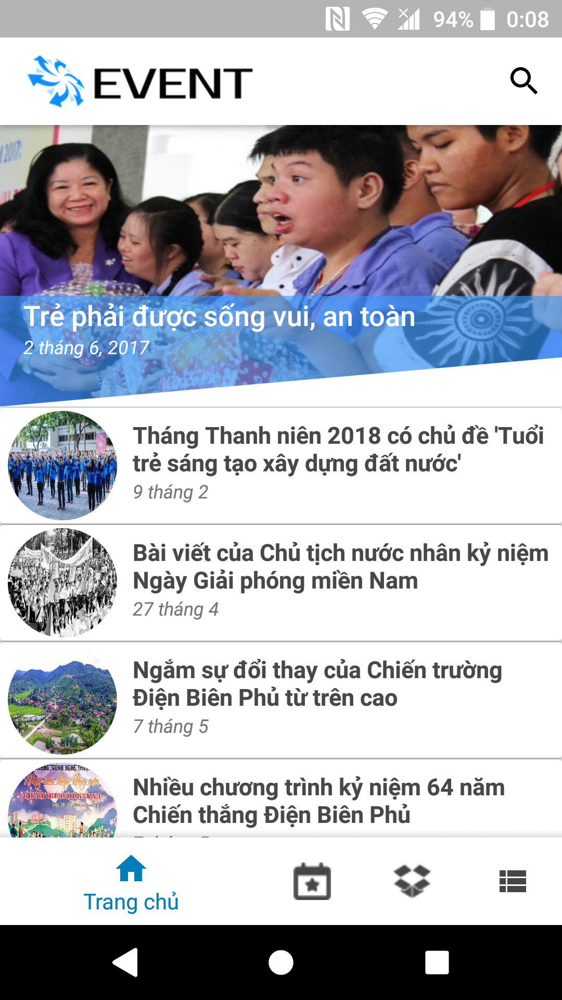
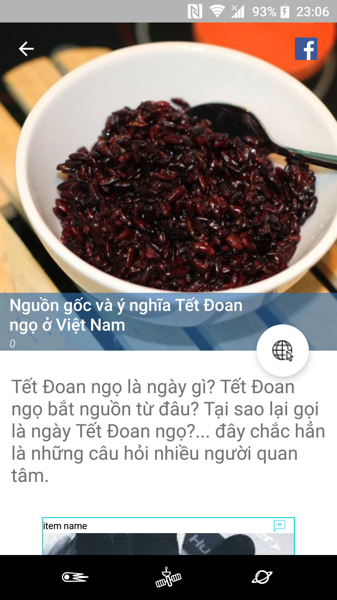
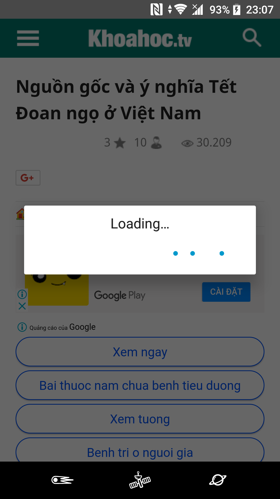
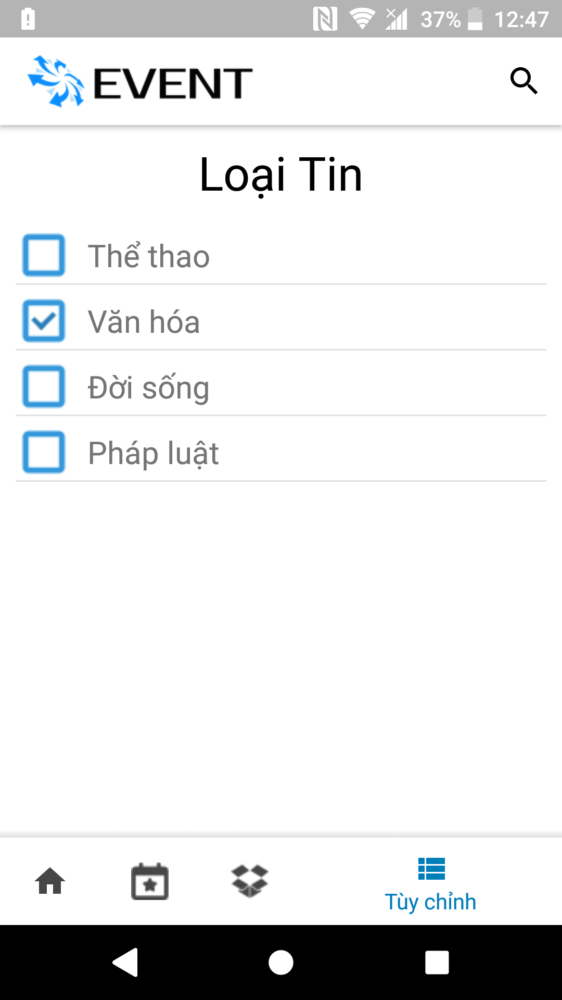
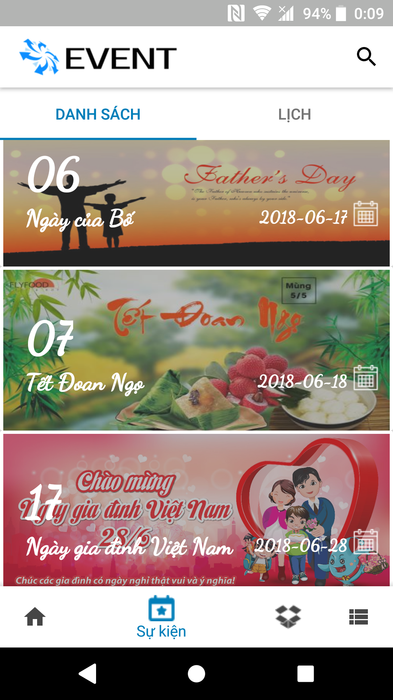
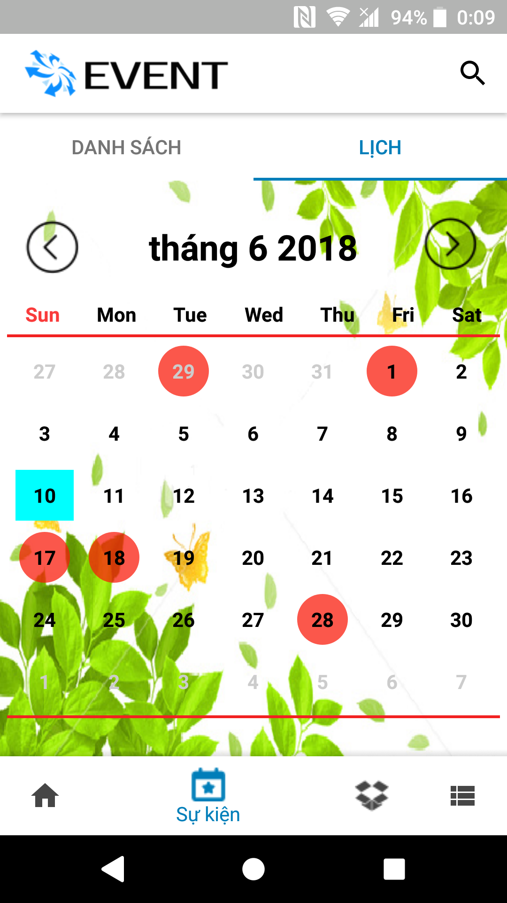
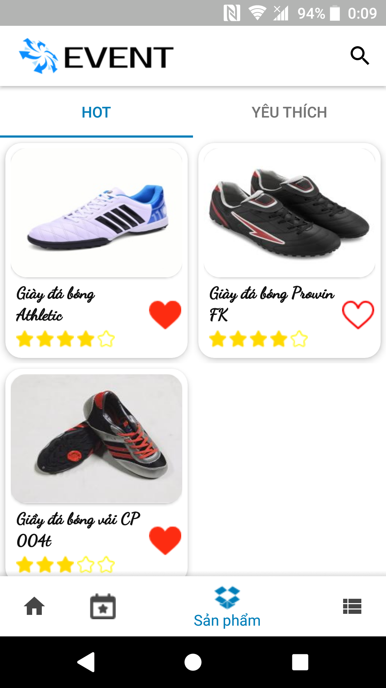
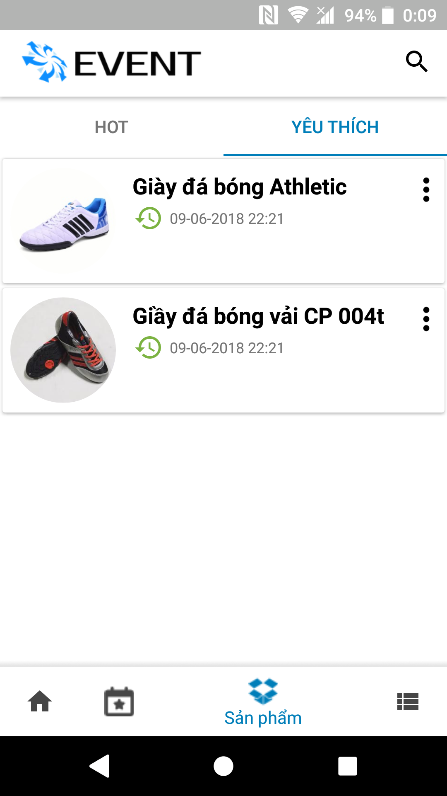

# Ứng dụng ăn theo sự kiện lớn

Ứng dụng cập nhật các sự kiện lớn diễn ra trong nước, thông tin các các ngày lễ hội, các ngày kỉ niệm lớn trong năm.
Xem các mặt hàng hot trên thị trường.

## Nội dung
1. [Chức năng](#chức-năng)

   1. [Xem tin tức](#xem-tin-tức)
   
   1. [Xem các ngày lễ trong năm](#xem-các-ngày-lễ-trong-năm)
   
   1. [Xem các sản phẩm](#xem-các-sản-phẩm)
   
1. [Yêu cầu thiết bị](#yêu-cầu-thiết-bị)

1. [Thư viện và công nghệ](#thư-viện-và-công-nghệ)

1. [Tác giả](#tác-giả)

1. [Giấy phép](#giấy-phép)

## Chức năng
### Xem tin tức
   * Danh sách tin 
  
   * Tóm tắt tin
  
   * Chia sẻ tin
   
   * Loại tin
   
   * Web tin
   
   

     
   

   

    
   

    
### Xem các ngày lễ trong năm
   * Danh sách các ngày lễ
  
   * Thông tin ngày lễ
  
   * Lịch ngày lễ
   
   

     
   

### Xem các sản phẩm
   * Sản phẩm hot
  
   * Sản phẩm yêu thích
   
   

    
   

   
## Yêu cầu thiết bị
-Android studio : 3.0.1

-Gradle : 4.1

-Min sdk : 19

-Target sdk : 26

-Language : Java

## Thư viện và công nghệ
* Firebase - https://firebase.google.com/

* Room database - https://developer.android.com/topic/libraries/architecture/room

* Facebook sdk - https://developers.facebook.com/docs/android/componentsdks

* Picasso - http://square.github.io/picasso/

* Spots Dialog - https://github.com/d-max/spots-dialog

* Kenburnsview - https://github.com/flavioarfaria/KenBurnsView

* RxJava - https://github.com/ReactiveX/RxJava

* Floating Action Button - https://github.com/Clans/FloatingActionButton

* Android Support Library - http://developer.android.com/tools/support-library/index.html

## Tác giả
Lê Trọng Tín - 15520893@gm.uit.edu.vn

Huỳnh Việt Tiến - 15520877@gm.uit.edu.vn

Hồ Hoàng Phi Long - 15520439@gm.uit.edu.vn

Nguyễn Văn Trạng - 15520920@gm.uit.edu.vn

## Giấy phép

    Copyright 2014

    Licensed under the Apache License, Version 2.0 (the "License");
    you may not use this file except in compliance with the License.
    You may obtain a copy of the License at

       http://www.apache.org/licenses/LICENSE-2.0

    Unless required by applicable law or agreed to in writing, software
    distributed under the License is distributed on an "AS IS" BASIS,
    WITHOUT WARRANTIES OR CONDITIONS OF ANY KIND, either express or implied.
    See the License for the specific language governing permissions and
    limitations under the License.
