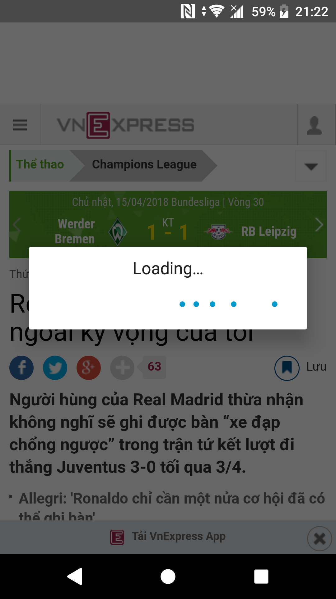
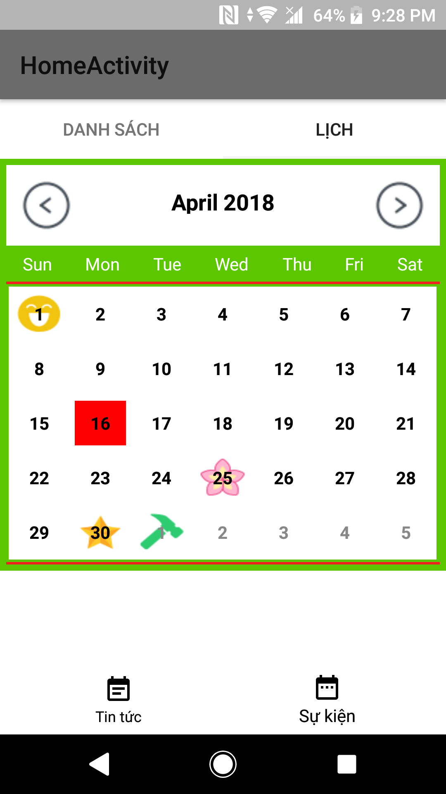

# Ứng dụng ăn theo sự kiện lớn

Ứng dụng cập nhật các sự kiện lớn diễn ra trong nước, thông tin các các ngày lễ hội, các ngày kỉ niệm lớn trong năm.

Xem các mặt hàng hot trên thị trường.

## Nội dung

1. [Chức năng](#chức-năng)
   1. [Xem tin tức](#xem-tin-tức)
   1. [Xem các ngày lễ trong năm](#xem-các-ngày-lễ-trong-năm)
   1. [Xem các mặt hàng hot](#xem-các-mặt-hàng-hot)
1. [Thư viện và công nghệ](#thư-viện-và-công-nghệ)

## Chức năng
### Xem tin tức
   * Danh sách tin 
  
   * Tóm tắt tin
  
   * Chi tiết tin
   
   

     
   

    
### Xem các ngày lễ trong năm
   * Danh sách các ngày lễ đếm ngược 
  
   * Thông tin ngày lễ
  
   * Lịch ngày lễ
   
   

     
   

### Xem các mặt hàng hot
   
## Thư viện và công nghệ
